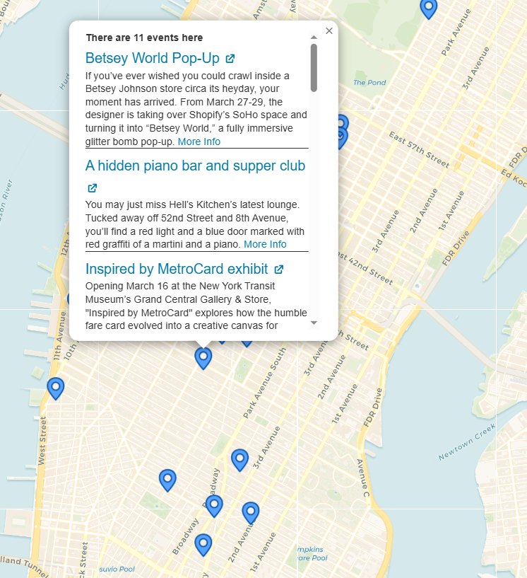

Application that aggregates events and displays them on an interactive map. A proof of concept project that integrates Google Gemini Flash in order to extract location data from unstructured text, providing a list of geocoding inputs that can be placed on the map.
https://nyc-events-map.vercel.app/

